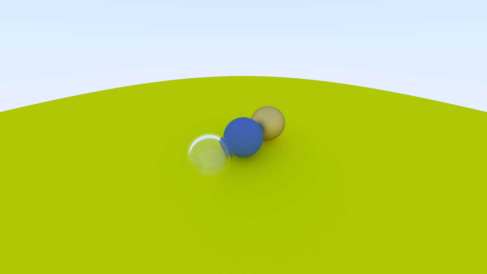
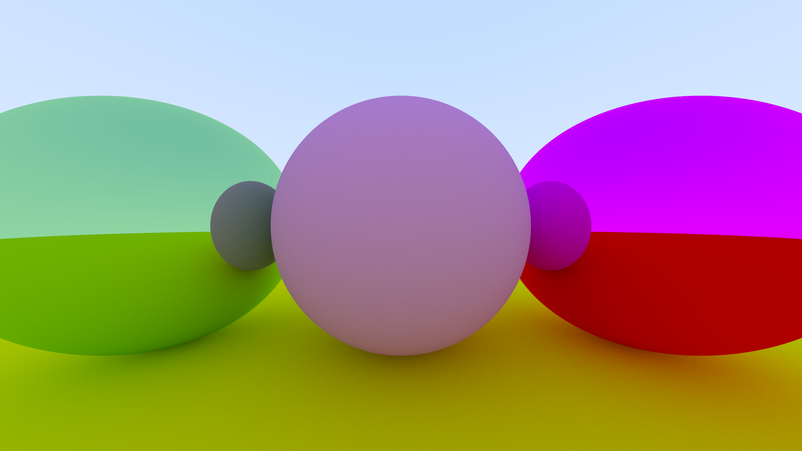

# Simplistic Ray Tracer
<!-- 
[![Build Status][travis-badge]][travis-repo]

[travis-badge]: https://travis-ci.com/rust-lang/rust-by-example.svg?branch=master
[travis-repo]: https://travis-ci.com/rust-lang/rust-by-example -->

Based off of [RayTracingInOneWeekend](https://raytracing.github.io/books/RayTracingInOneWeekend.html)

## Using

If you'd like to use it locally, [install Rust], and then:

```bash
$ cargo run --release
```

A image.ppm will be produced which can then be viewed using a [PPM Viewer](https://www.cs.rhodes.edu/welshc/COMP141_F16/ppmReader.html).

[install Rust]: https://www.rust-lang.org/tools/install


# Examples





## Future Plans:
- [ ] Triangles 
- [ ] Optimise for performance
- [ ] Lights
- [ ] Textures
- [ ] Volumes
- [ ] Parallelism


## Wow that was longer than a weekend...


